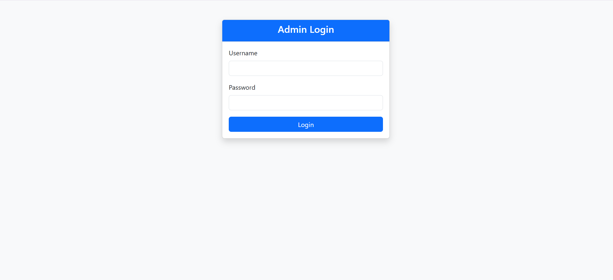
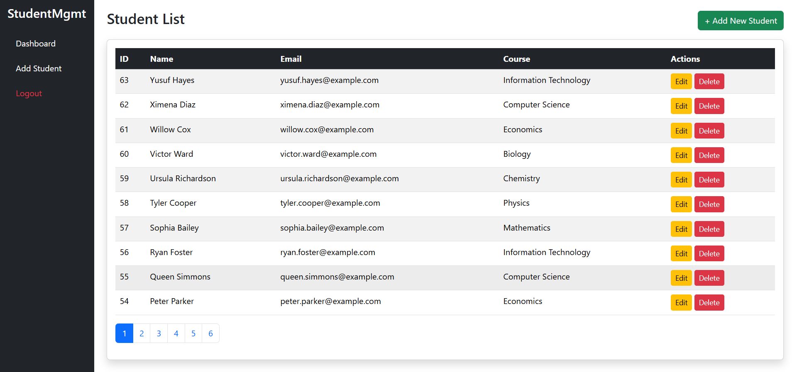
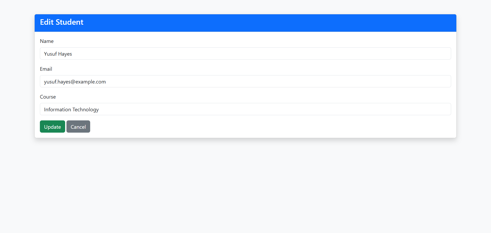

# Student Management System

A **web-based Student Management System** built with **PHP, MySQL, and Bootstrap**, featuring **CRUD operations, admin authentication, session management, and paginated student listing**.

---

## Features

- **Admin Authentication** – Secure login with hashed passwords (`password_hash` + `password_verify`).  
- **Student CRUD** – Add, update, delete, and view student records.  
- **Pagination** – Students table is paginated for better usability.  
- **Responsive UI** – Built with **Bootstrap 5**.  
- **Session Management** – Prevents unauthorized access and redirects logged-in users.  
- **Secure Database Queries** – Core PHP with MySQLi prepared statements to prevent SQL injection.  
- **Sidebar Navigation** – Collapsible sidebar with quick links.  

---

## Project Structure

```text
student_mgmt/
├── config/             # DB connection (MySQLi)
├── public/             # Entry points: login.php, dashboard.php, student_form.php, logout.php
├── src/
│   ├── auth/           # Auth.php for login/logout/session
│   ├── controllers/    # StudentController.php
│   ├── models/         # Student.php
├── views/              # Optional: if separating templates
├── assets/             # CSS, JS (Bootstrap, custom)
├── logs/               # Error logs
└── README.md

## Screenshots

### Login Page


### Dashboard with Pagination


### Add Student Form


